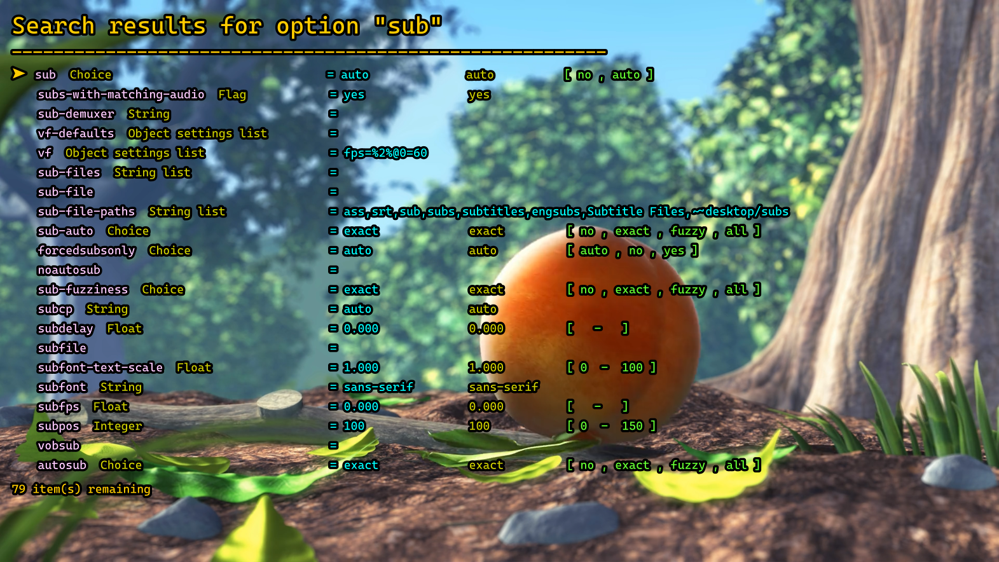
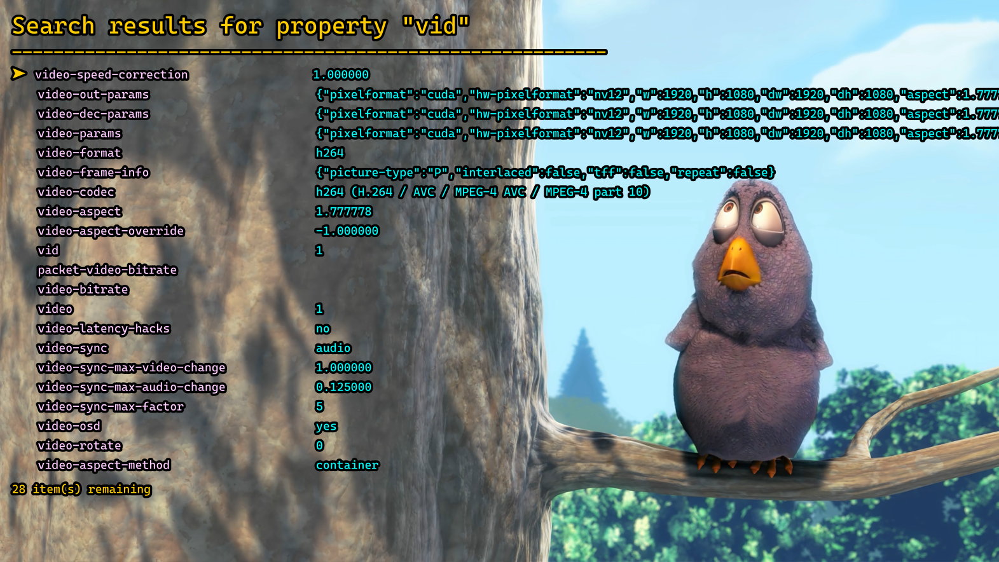

# mpv-search-page

This script allows you to search for keybinds, properties, options and commands and have matching entries display on the OSD.
The search is case insensitive by default, and the script sends the filter directly to a lua string match function, so you can use patterns to get more complex filtering. For options and limitations see the [Queries](#queries) and [Flags](#flags) sections.

This script requires [mpv-scroll-list](https://github.com/CogentRedTester/mpv-scroll-list) to work, simply place `scroll-list.lua` into the `~~/script-modules` folder.

## Pages

The search pages will remain open until the esc key is pressed. When the page is open the up and down arrow can be used to scroll through the results, and the left and right arrows can be used to pan horizontally to see any cut off values.

There are 4 main search pages, each page has its own independant state, and while open one can cycle between them in the below order:

### Keybinds

The keybind page is for searching keybindings. By default the script searches the name of the key; the command the key runs; the input section the key is part of; the owner of the key (typically the script that creates it); and any comments on the same line as the key in input.conf.

The search page shows the key name in lavendar on the left, then the command in cyan, and finally the comment in green, preceeded by a `#`. In addition, if the keybinding is part of a section other than the default, the section will be printed in yellow brackets between the key name and the command.

Pressing keys 1-9 will send the command for that respective entry.

Keybinds which are disabled or overridden will be shown at 50% opacity.

### Commands

The command page displays input commands that can be used in input.conf or the console, as well as their arguments. The script only searches the name of the commands.

The search page shows all of the command names in lavendar on the left. The following words are arguments that the command takes, green arguments are compulsory, while cyan are optional. Each argument contains its type in small yellow brackets. Note that the type, and colour-coding is taken straight from the lua API, so it may not always be correct.

Pressing keys 1-9 will load the command for that respective entry into console.lua, and print the arguments and their types to the console for reference. Compulsory arguments will have an exclamation mark before them.

### Options

The options page is for searching options that can be set on the commandline or through mpv.conf. Most of these options have matching properties. The script searches the option name, as well as any choices that are available.

The option page contains the option name in lavendar, directly followed by the option type in yellow. The cyan entry is the current value of the option, if available, and the yellow is the default option value. The green value shows different information depending on the option type; if the option is a float, integer, double, aspect, or bytesize, then the valid option range is displayed; if the option is a choice, then the valid choices are listed.

### Properties

The properties page shows all of the properties, and their current values, for the current file. Only the property name is included in the search. Note that the property list contains most options as well.

The search page simply contains the property name on the left, followed by it's current value (if it has one).

## Default Keybinds

The default keybinds are listed below, these can be overwritten using input.conf. Their purposes should be self evident:

    f12                 script-binding search-keybinds
    Ctrl+f12            script-binding search-commands
    Shift+f12           script-binding search-properties
    Alt+f12             script-binding search-options

In addition the following keybinds are dynamically created when the search page is open, these cannot currently be changed:

    esc             closes the search page
    down            scrolls the page down
    up              scrolls the page up
    left            pans the whole search page left
    right           pans the whole search page right
    Shift+left      open prev page
    Shift+right     open next page
    Ctrl+left       open prev page and run latest search
    Ctrl+right      open next page and run latest search
    Ctrl+enter      re-run latest search on current page
    enter           see jumplist
    1-9             see jumplist

The jumplist keys are only bound if the corresposnding result actually exists.

## Queries

When the default f12 keybinds are used, console.lua will open with a pre-entered query command and the query type argument already entered. You then just need to type the search string and press enter.

The raw command is:

    script-message search_page/input [query types] [query string] {flags}

Here is an example of a query to search keybinds for 'del':

    script-message search_page/input key$ del

 Queries can have spaces in them, but if so they must be enclosed in double quotes:

    script-message search_page/input key$ "cycle vid"

The valid query types are as follows:

    key$    searches keybindings
    cmd$    searches command
    prop$   searches properties
    opt$    searches options

Sending a query message without any arguments (or with only the type argument) will reopen the last search page. Sending a query with an empty string `""` will show all results for the selected category.

## Lua Patterns

This script sends queries into the Lua string find function, the find function supports something called [patterns](http://lua-users.org/wiki/PatternsTutorial) to help make more complex searches. In order to facilitate this there are a number of symbols (`^$()%.[]*+-?`), which are reserved for pattern creation.
By default the script will escape these special characters to make searches more convenient, however this can be disabled with the `pattern` [flag](#flags).

## Flags

By default the script will convert both the search query, and all the strings it scans into lower case to maximise the number of results, as well as escaping special pattern characters. It returns any result that contains the full query somewhere in its values. Flags can be used to modify this behaviour. Flags are an argument you can add after the query string, currently there are 3:

        wrap        search for a whole word only (may not work with some symbols)
        pattern     don't convert the query to lowercase and don't escape pattern characters
        exact       don't convert anything into lowercase

These flags can be combined, so for example a query `t wrap` would normally result in both lower and upper case t matches, however, `t wrap+exact` will return only lowercase t. The pattern flag is only useful when doing some funky pattern stuff, for example:
`f%A wrap+pattern` will return all complete words containing f followed by a non-letter. Often `exact` will work just fine for this,
but in this example we might still want to find upper-case keys, like function keys, so using just `pattern` can be more useful.

Here is an example of a query to list all function keybinds:

    script-message search_page/input key$ f%d%d? wrap

## Jumplist

The keybind and command pages have a jumplist implementation, while on the search page you can press the number keys, 1-9,
to select the entry at that location. On the keybinds page it runs the command without exitting the page,
on the commands page it exits the page and loads the command up into console.lua.

In addition, you can press enter to run the jump command on the currently selected result in the list when scrolling.

## Configuration

Search page will read several options from script-opts when the player is lanched, the current options, and their defaults are:

    enable_jumplist = yes   #disables the jumplist keybinds
    max_list = 26           #number of search results to show
    pan_speed = 100         #horizontal pixels to pan on each keypress

In addition there are a sizeable number of options to customise the ass tags that the page uses. This theoretically allows you to customise the page in almost any way you like. There are far too many to show here.

The full list of options, and their defaults are shown in [search_page.conf](search_page.conf).

## Future Plans

Some ideas for future functionality:

* ~~Implement scrolling~~
* Json options file to configure jumplist behaviour/commands
  * Add jumplists for properties and options
  * Add multiple commands for each item using Ctrl,Alt, etc
  * Implement a cursor to select items for commands (same as jumplist)
* Search multiple queries at once (may already be possible with lua patterns)
